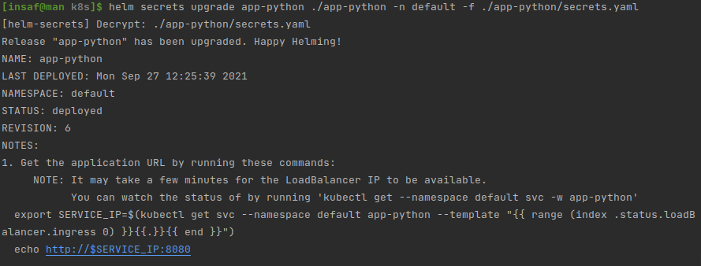

# K8s secrets and resources

## Create secret with kubectl

Create files with secrets:
```bash
echo -n 'first_user' > ./username.txt
echo -n 'first_password' > ./password.txt
```

Create secrets from these files
```bash
kubectl create secret generic first-secret \
  --from-file=username=./username.txt \
  --from-file=password=./password.txt
```

Results:


Verify and decode secrets
```bash
kubectl get secrets
kubectl describe secrets/first-secret
kubectl get secret first-secret -o jsonpath='{.data.username}' | base64 --decode
kubectl get secret first-secret -o jsonpath='{.data.password}' | base64 --decode
```

Results


## Helm

Apply secrets and validate

```shell
helm secrets upgrade app-python ./app-python -n default -f ./app-python/secrets.yaml
```



