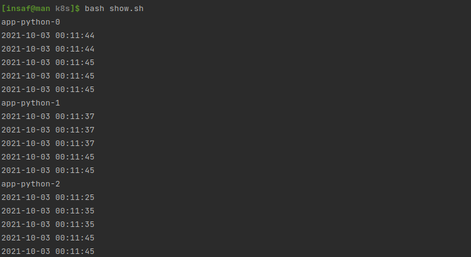

# K8s StatefulSet

> Output of ```kubectl get po,sts,svc,pvc``` command


```bash
[insaf@man k8s]$ kubectl get po,sts,svc,pvc
NAME               READY   STATUS    RESTARTS   AGE
pod/app-python-0   1/1     Running   0          5m54s
pod/app-python-1   1/1     Running   0          5m33s
pod/app-python-2   1/1     Running   0          5m23s

NAME                          READY   AGE
statefulset.apps/app-python   3/3     5m54s

NAME                 TYPE           CLUSTER-IP       EXTERNAL-IP   PORT(S)          AGE
service/app-python   LoadBalancer   10.101.211.247   <pending>     8080:30217/TCP   5m54s
service/kubernetes   ClusterIP      10.96.0.1        <none>        443/TCP          5d5h

NAME                                                        STATUS   VOLUME                                     CAPACITY   ACCESS MODES   STORAGECLASS   AGE
persistentvolumeclaim/visits-volume-template-app-python-0   Bound    pvc-db3acfdf-3dbe-4814-9c27-d3f0abc43672   128M       RWO            standard       133m
persistentvolumeclaim/visits-volume-template-app-python-1   Bound    pvc-30c0c32a-71fe-46b3-9613-93b8ac67275c   128M       RWO            standard       133m
persistentvolumeclaim/visits-volume-template-app-python-2   Bound    pvc-fcbbca61-11b8-493f-8c84-fb141b880711   128M       RWO            standard       133m
```


> Show /media/visits.txt of containers (used [shell script](./show.sh))



> Describe and explain in the report the differences between the output 
> of the command for replicas.

One can see that the outputs of containers differ. 
This behaviour is caused by different containers having 
different volumes when using `StatefulSet` with `volumeClaimTemplates`. 
Each replica has its own volume and if the replica is terminated, its`
volume will be assigned to new replica.
Using deployment would cause all the containers having the same volume and, 
thus slowing down due to concurrent access.

> For our app ordering guarantee are unnecessary. 
> Describe in the report why.

Running replicas are completely independent of each other. 
Thus ordering only makes startup longer and does not give any advantages.

> Then find a way to tell to the StatefulSet controller 
> to launch or terminate all Pods in parallel. Implement it.


I implemented it setting `PodManagementPolicy` to `Parallel`

Check that containers started simultaneously
```bash
[insaf@man k8s]$ kubectl get po
NAME           READY   STATUS    RESTARTS   AGE
app-python-0   0/1     Running   0          18s
app-python-1   0/1     Running   0          18s
app-python-2   0/1     Running   0          18s
```