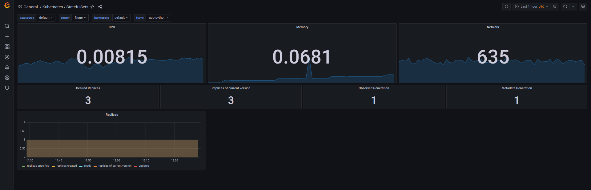
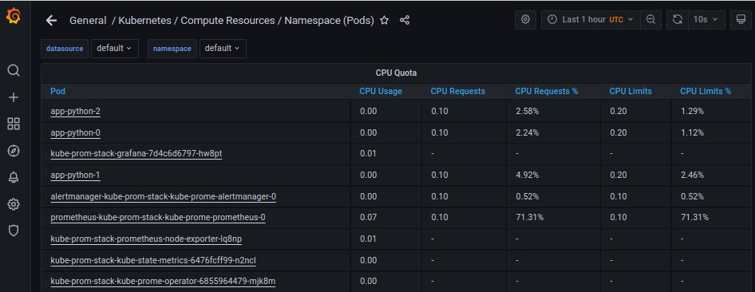
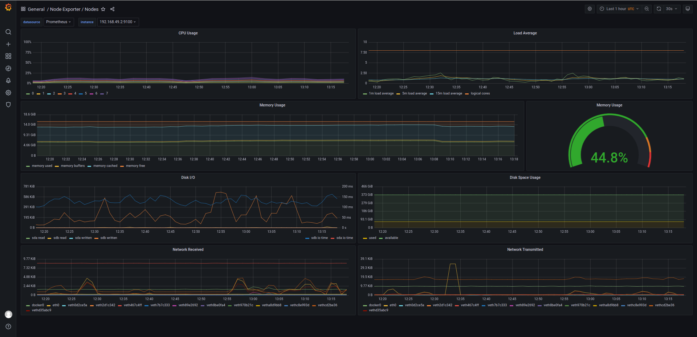
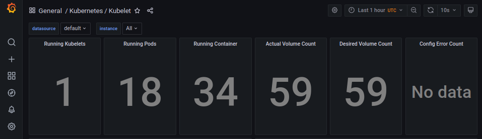
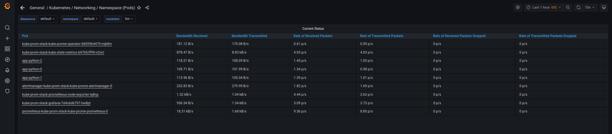
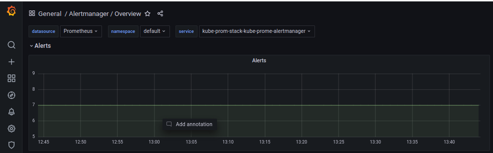

# k8s cluster monitoring with Prometheus

## Components of kube-prometheus-stack

### [The Prometheus Operator](https://github.com/prometheus-operator/prometheus-operator)
Plugin for Prometheus in Kubernetes

### [Highly available Prometheus](https://prometheus.io/)
Tool for collecting metrics

### [Highly available Alertmanager](https://github.com/prometheus/alertmanager)
Tool for collecting alerts from applications and sending them to configured 
emails and etc

### [Prometheus node-exporter](https://github.com/prometheus/node_exporter)
Tool for collecting OS metrics

### [Prometheus Adapter for Kubernetes Metrics APIs](https://github.com/DirectXMan12/k8s-prometheus-adapter)
Tool for collecting internal metrics of kubernetes, such as pods, nodes, resources and etc

### [kube-state-metrics](https://github.com/kubernetes/kube-state-metrics)
Tool for collecting raw metrics from kubernetes components

### [Grafana](https://grafana.com/)
Tool for visualisation of metrics and logs

## Installation
```bash
[insaf@man k8s]$ helm repo add prometheus-community https://prometheus-community.github.io/helm-charts
"prometheus-community" has been added to your repositories

[insaf@man k8s]$ helm repo update
Hang tight while we grab the latest from your chart repositories...
...Successfully got an update from the "bitnami" chart repository
...Successfully got an update from the "prometheus-community" chart repository
Update Complete. ⎈Happy Helming!⎈

[insaf@man k8s]$ helm install kube-prom-stack prometheus-community/kube-prometheus-stack
**W1004 deprication errors**
NAME: kube-prom-stack
LAST DEPLOYED: Mon Oct  4 14:14:26 2021
NAMESPACE: default
STATUS: deployed
REVISION: 1
NOTES:
kube-prometheus-stack has been installed. Check its status by running:
  kubectl --namespace default get pods -l "release=kube-prom-stack"

Visit https://github.com/prometheus-operator/kube-prometheus for instructions on how to create & configure Alertmanager and Prometheus instances using the Operator.
```

### kubectl get po,sts,svc,pvc,cm 
Show states of pods, StatefulSets, services, persistentVolumeClaims and
configmaps respectively

```bash
[insaf@man k8s]$ kubectl get po,sts,svc,pvc,cm 
NAME                                                         READY   STATUS              RESTARTS   AGE
pod/alertmanager-kube-prom-stack-kube-prome-alertmanager-0   0/2     ContainerCreating   0          4m35s
pod/app-python-0                                             1/1     Running             0          37h
pod/app-python-1                                             1/1     Running             0          37h
pod/app-python-2                                             1/1     Running             0          37h
pod/kube-prom-stack-grafana-7d4c6d6797-hw8pt                 0/2     PodInitializing     0          5m19s
pod/kube-prom-stack-kube-prome-operator-6855964479-mjk8m     1/1     Running             0          5m19s
pod/kube-prom-stack-kube-state-metrics-6476fcff99-n2ncl      1/1     Running             0          5m19s
pod/kube-prom-stack-prometheus-node-exporter-lq8np           1/1     Running             0          5m19s
pod/prometheus-kube-prom-stack-kube-prome-prometheus-0       0/2     Init:0/1            0          4m34s

NAME                                                                    READY   AGE
statefulset.apps/alertmanager-kube-prom-stack-kube-prome-alertmanager   0/1     4m35s
statefulset.apps/app-python                                             3/3     37h
statefulset.apps/prometheus-kube-prom-stack-kube-prome-prometheus       0/1     4m34s

NAME                                               TYPE           CLUSTER-IP       EXTERNAL-IP   PORT(S)                      AGE
service/alertmanager-operated                      ClusterIP      None             <none>        9093/TCP,9094/TCP,9094/UDP   4m35s
service/app-python                                 LoadBalancer   10.109.129.168   <pending>     8080:31225/TCP               37h
service/kube-prom-stack-grafana                    ClusterIP      10.96.219.226    <none>        80/TCP                       5m20s
service/kube-prom-stack-kube-prome-alertmanager    ClusterIP      10.103.49.95     <none>        9093/TCP                     5m20s
service/kube-prom-stack-kube-prome-operator        ClusterIP      10.101.123.37    <none>        443/TCP                      5m20s
service/kube-prom-stack-kube-prome-prometheus      ClusterIP      10.96.70.137     <none>        9090/TCP                     5m20s
service/kube-prom-stack-kube-state-metrics         ClusterIP      10.105.111.49    <none>        8080/TCP                     5m20s
service/kube-prom-stack-prometheus-node-exporter   ClusterIP      10.101.169.126   <none>        9100/TCP                     5m20s
service/kubernetes                                 ClusterIP      10.96.0.1        <none>        443/TCP                      6d20h
service/prometheus-operated                        ClusterIP      None             <none>        9090/TCP                     4m34s

NAME                                                        STATUS   VOLUME                                     CAPACITY   ACCESS MODES   STORAGECLASS   AGE
persistentvolumeclaim/visits-volume-template-app-python-0   Bound    pvc-db3acfdf-3dbe-4814-9c27-d3f0abc43672   128M       RWO            standard       40h
persistentvolumeclaim/visits-volume-template-app-python-1   Bound    pvc-30c0c32a-71fe-46b3-9613-93b8ac67275c   128M       RWO            standard       40h
persistentvolumeclaim/visits-volume-template-app-python-2   Bound    pvc-fcbbca61-11b8-493f-8c84-fb141b880711   128M       RWO            standard       40h

NAME                                                                     DATA   AGE
configmap/app-python                                                     1      37h
configmap/kube-prom-stack-grafana                                        1      5m21s
configmap/kube-prom-stack-grafana-config-dashboards                      1      5m21s
configmap/kube-prom-stack-grafana-test                                   1      5m21s
configmap/kube-prom-stack-kube-prome-alertmanager-overview               1      5m21s
configmap/kube-prom-stack-kube-prome-apiserver                           1      5m21s
configmap/kube-prom-stack-kube-prome-cluster-total                       1      5m21s
configmap/kube-prom-stack-kube-prome-controller-manager                  1      5m21s
configmap/kube-prom-stack-kube-prome-etcd                                1      5m21s
configmap/kube-prom-stack-kube-prome-grafana-datasource                  1      5m21s
configmap/kube-prom-stack-kube-prome-k8s-coredns                         1      5m21s
configmap/kube-prom-stack-kube-prome-k8s-resources-cluster               1      5m21s
configmap/kube-prom-stack-kube-prome-k8s-resources-namespace             1      5m21s
configmap/kube-prom-stack-kube-prome-k8s-resources-node                  1      5m21s
configmap/kube-prom-stack-kube-prome-k8s-resources-pod                   1      5m21s
configmap/kube-prom-stack-kube-prome-k8s-resources-workload              1      5m21s
configmap/kube-prom-stack-kube-prome-k8s-resources-workloads-namespace   1      5m21s
configmap/kube-prom-stack-kube-prome-kubelet                             1      5m21s
configmap/kube-prom-stack-kube-prome-namespace-by-pod                    1      5m21s
configmap/kube-prom-stack-kube-prome-namespace-by-workload               1      5m21s
configmap/kube-prom-stack-kube-prome-node-cluster-rsrc-use               1      5m21s
configmap/kube-prom-stack-kube-prome-node-rsrc-use                       1      5m21s
configmap/kube-prom-stack-kube-prome-nodes                               1      5m21s
configmap/kube-prom-stack-kube-prome-persistentvolumesusage              1      5m21s
configmap/kube-prom-stack-kube-prome-pod-total                           1      5m21s
configmap/kube-prom-stack-kube-prome-prometheus                          1      5m21s
configmap/kube-prom-stack-kube-prome-proxy                               1      5m21s
configmap/kube-prom-stack-kube-prome-scheduler                           1      5m21s
configmap/kube-prom-stack-kube-prome-statefulset                         1      5m21s
configmap/kube-prom-stack-kube-prome-workload-total                      1      5m21s
configmap/kube-root-ca.crt                                               1      18d
configmap/prometheus-kube-prom-stack-kube-prome-prometheus-rulefiles-0   28     4m35s
```

## Monitoring

By default, command `minikube service kube-prom-stack-grafana` gives no
port for access
```bash
[insaf@man k8s]$ minikube service kube-prom-stack-grafana
|-----------|-------------------------|-------------|--------------|
| NAMESPACE |          NAME           | TARGET PORT |     URL      |
|-----------|-------------------------|-------------|--------------|
| default   | kube-prom-stack-grafana |             | No node port |
|-----------|-------------------------|-------------|--------------|
😿  service default/kube-prom-stack-grafana has no node port
```

I need to open port for `kube-prom-stack-grafana`.

I found instructions in [this tutorial](https://linuxblog.xyz/posts/kube-prometheus-stack/https://linuxblog.xyz/posts/kube-prometheus-stack/)

All we need is to create a tunnel proxy to pod with grafana
```bash
[insaf@man k8s]$ kubectl port-forward pod/kube-prom-stack-grafana-7d4c6d6797-hw8pt 3000
```

After that Grafana is accessible on `127.0.0.1:3000`
However, default credential are not `admin/admin` but `admin/prom-operator`
as stated in [the same tutorial](https://linuxblog.xyz/posts/kube-prometheus-stack/)

### CPU and Memory utilization


By default, units of memory are not shown, so I found them in query fields

`sum(container_memory_usage_bytes{job="kubelet", metrics_path="/metrics/cadvisor", cluster="", 
container!="", namespace="default", pod=~"app-python.*"}) / 1024^3`

which is gigabytes 

Units of cpu are calculated by `sum(rate(container_cpu_usage_seconds_total{job="kubelet", 
metrics_path="/metrics/cadvisor", cluster="", 
container!="", namespace="default", pod=~"app-python.*"}[3m]))`

which is number of CPU cores used by containers as stated
[here](https://blog.freshtracks.io/a-deep-dive-into-kubernetes-metrics-part-3-container-resource-metrics-361c5ee46e66)

StatefulSet consumes `~68mb` and `~1%` CPU core

### Check which Pod is using CPU more than others and which is less in the default namespace.



The Pod which uses most CPU is `prometheus-kube-prom-stack-kube-prome-prometheus-0`

The Pods that use almost no CPu are
* app-python-0
* app-python-1
* app-python-2
* alertmanager-kube-prom-stack-kube-prome-alertmanager-0
* kube-prom-stack-kube-state-metrics-6476fcff99-n2ncl
* kube-prom-stack-kube-prome-operator-6855964479-mjk8m

### Check how much memory is used on your node, in % and mb.


As soon as the node is my pc, usage is `45%` and `7.2gb (45% of 16gb)`

### Check how many pods and containers actually ran by the Kubelet service.

There are `18` pods and `34` containers



### Check which Pod is using network more than others and which is less in the default namespace.



`prometheus-kube-prom-stack-kube-prome-prometheus-0` uses network more than others
`app-python-0` uses network less than others

### Check how many alerts you have. 



## Init containers

Implement init container to fetch some html page

Check that init containers run

```bash
[insaf@man k8s]$ kubectl get po,sts
NAME                                                         READY   STATUS     RESTARTS   AGE
pod/alertmanager-kube-prom-stack-kube-prome-alertmanager-0   2/2     Running    0          5h3m
pod/app-python-0                                             0/1     Init:0/1   0          5s
pod/app-python-1                                             0/1     Init:0/1   0          5s
pod/app-python-2                                             0/1     Init:0/1   0          5s
pod/kube-prom-stack-grafana-7d4c6d6797-hw8pt                 2/2     Running    0          5h4m
pod/kube-prom-stack-kube-prome-operator-6855964479-mjk8m     1/1     Running    0          5h4m
pod/kube-prom-stack-kube-state-metrics-6476fcff99-n2ncl      1/1     Running    0          5h4m
pod/kube-prom-stack-prometheus-node-exporter-lq8np           1/1     Running    0          5h4m
pod/prometheus-kube-prom-stack-kube-prome-prometheus-0       2/2     Running    0          5h3m

NAME                                                                    READY   AGE
statefulset.apps/alertmanager-kube-prom-stack-kube-prome-alertmanager   1/1     5h3m
statefulset.apps/app-python                                             0/3     5s
statefulset.apps/prometheus-kube-prom-stack-kube-prome-prometheus       1/1     5h3m
```

And after initContainers terminate fetch the file from volume

```bash
[insaf@man k8s]$ kubectl exec pod/app-python-0 -- cat /media/pages/index.html
Defaulted container "app-python" out of: app-python, download-some-file (init)
<html><head></head><body><header>
<title>http://info.cern.ch</title>
</header>

<h1>http://info.cern.ch - home of the first website</h1>
<p>From here you can:</p>
<ul>
<li><a href="http://info.cern.ch/hypertext/WWW/TheProject.html">Browse the first website</a></li>
<li><a href="http://line-mode.cern.ch/www/hypertext/WWW/TheProject.html">Browse the first website using the line-mode browser simulator</a></li>
<li><a href="http://home.web.cern.ch/topics/birth-web">Learn about the birth of the web</a></li>
<li><a href="http://home.web.cern.ch/about">Learn about CERN, the physics laboratory where the web was born</a></li>
</ul>
</body></html>
```