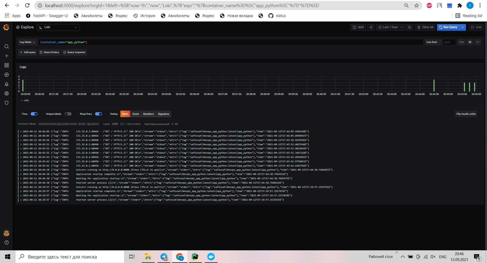
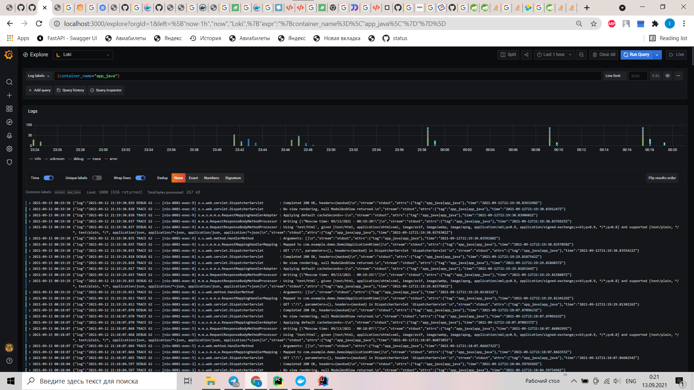
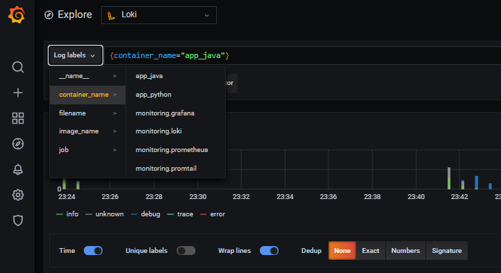
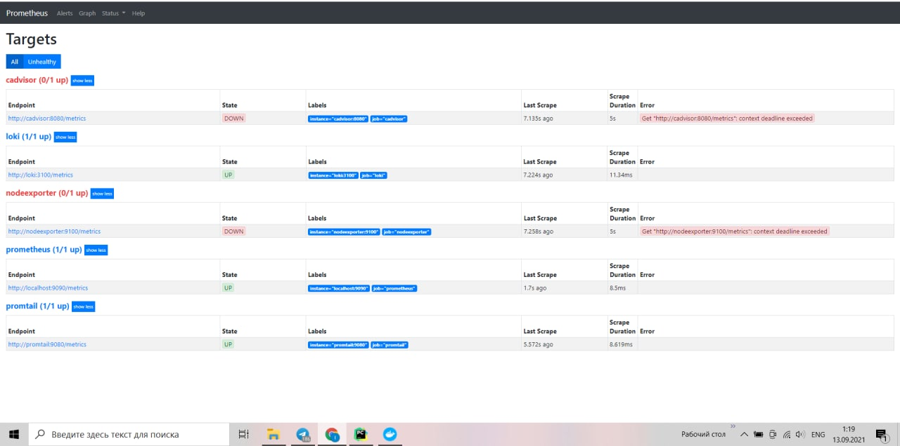
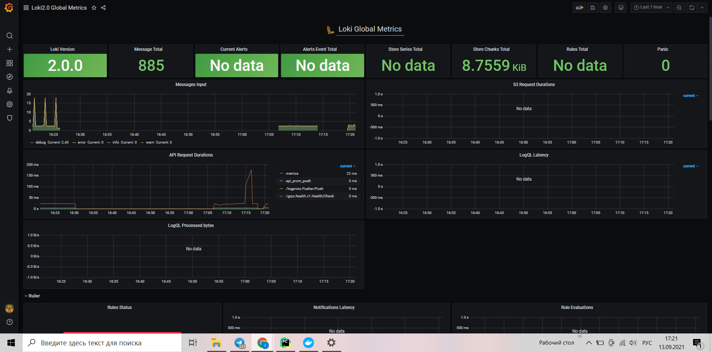
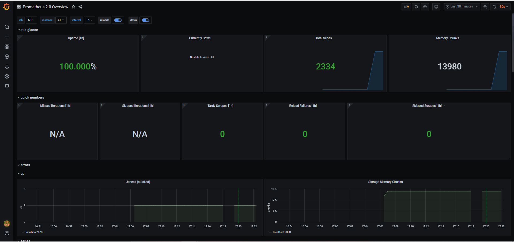
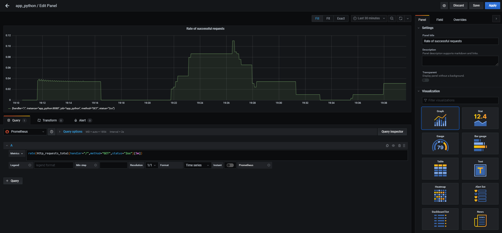

# Logging

## Screenshots
Accessing the app via container name

## Best practices
### Loki
* Static labels are good
* Use dynamic labels sparingly
* Label values must always be bounded
* Configure caching
* Logs must be in increasing time order per stream
* Use chunk_target_size

## Bonus task
Accessing the app_java via container name

Accessing all container logs

# Monitoring: Metrics

## Screenshots

## Bonus task

